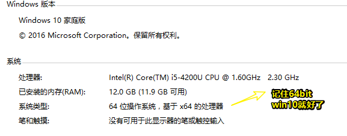
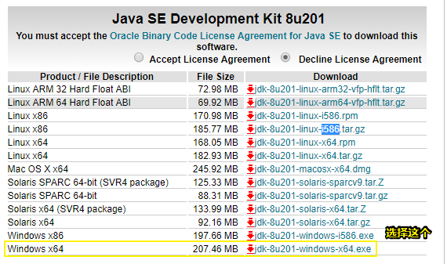
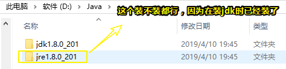
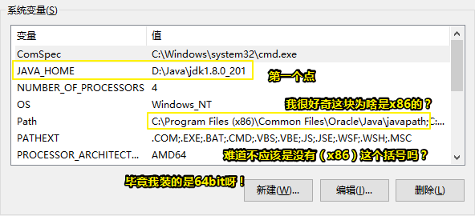
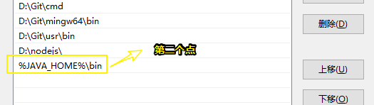
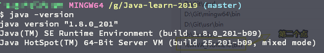
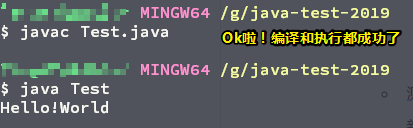
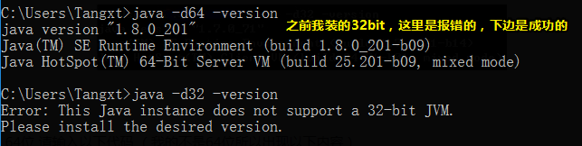

# Java开发环境搭建

## ★引子

为了使用一款叫「[HiJson](https://github.com/nblookup/HiJson)」的工具，于是就需要安装JDK了，起初，我以为只需要JVM，没想到连JDK也需要安装！之前我学过JAVA，不过我也大概忘记了！这次就算重新开始学习了！

## ★安装JDK

我的电脑配置：`win+PrtSc SysRq`



1. 下载：[Java SE Development Kit 8 - Downloads](https://www.oracle.com/technetwork/java/javase/downloads/jdk8-downloads-2133151.html)

   

2. 安装：[在 Win10 系统下安装 JDK 及配置环境变量的方法 - CG国斌的博客 - CSDN博客](https://blog.csdn.net/qq_35246620/article/details/61208961)

   1. 我没有装在默认的C盘，而是在D盘：

      

3. 环境变量配置，选择系统变量，只需要配置两个点即可：

   - 新建`JAVA_HOME`变量：

     

   - 为`Path`变量追加值：

     

4. 测试：

   - 看看版本：

   

   - 测试一下代码能否正常编译和执行：

     新建个Test.java文件，其内容如下：

     ```java
     public class Test {
         public static void main(String[] args) {
           System.out.println("Hello!World");
         }
     }
     ```

     切换到该文件的目录：

     

小结：

- 我第一次安装JVM（不要JDK）的时候，是到这个网站 [java.com: Java 与您](https://www.java.com/zh_CN/) 里边下载的，然而它给我下载的是32bit，真是操蛋啊！那么我是如何判断自己的安装的到底是多少位的呢？



**➹：**[java - 如何判断我是在64位JVM还是32位JVM（从程序中运行）？ - ITranslater](https://www.itranslater.com/qa/details/2105765411689071616)

- 删除32bit的JVM：

  1. 下载并运行这个工具：[Java 卸载工具](https://www.java.com/zh_CN/download/uninstalltool.jsp)
  2. 删掉一些残余数据，如自定义安装路径里边的数据，以及默认在C盘有的有关Oracle的Java程序数据，可以通过Everything来搜索定位
  3. 听说有删不干净的情况出现，我发现注册表并没有关Java数据

  **➹：**[为什么应该从系统卸载 Java 的早期版本？](https://www.java.com/zh_CN/download/faq/remove_olderversions.xml)

  **➹：**[jdk卸载不干净 - 石楠红叶 - 博客园](https://www.cnblogs.com/zhangnanblog/archive/2012/02/28/2371568.html)

- 配置环境变量时，无须classpath！

- 还可以使用scoop这个包管理工具来安装jdk！毕竟用它来搭建Java开发环境甚是方便，如安装和卸载！

- 其它安装教程：

  **➹：**[win10配置java环境变量的正确姿势 - 知乎](https://zhuanlan.zhihu.com/p/32619256)

## ★软件篇


